## Домашнее задание к занятию "Система мониторинга Zabbix. Часть 2" - Карих Елена
---
### Задание 1

Создайте свой шаблон, в котором будут элементы данных, мониторящие загрузку CPU и RAM хоста.
Процесс выполнения
1. Выполняя ДЗ сверяйтесь с процессом отражённым в записи лекции.
2. В веб-интерфейсе Zabbix Servera в разделе Templates создайте новый шаблон
3. Создайте Item который будет собирать информацию об загрузке CPU в процентах
4. Создайте Item который будет собирать информацию об загрузке RAM в процентах

### Решение 1
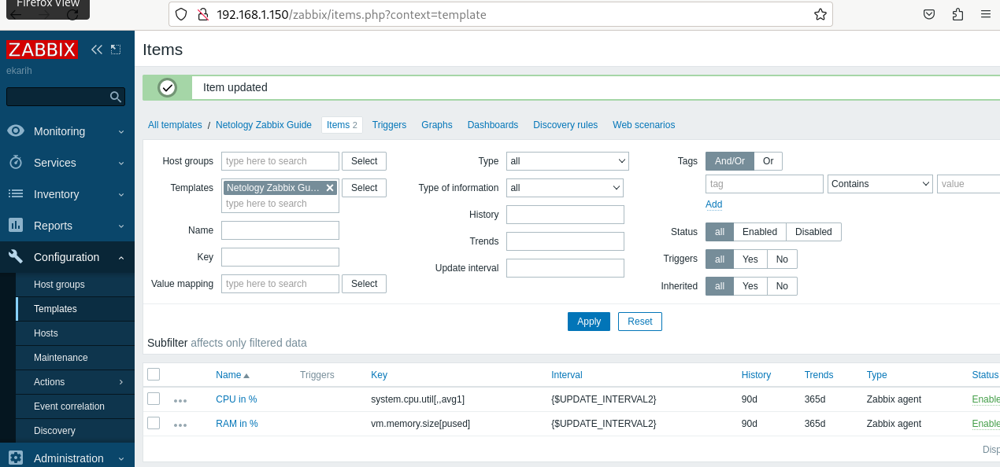
---
### Задание 2
Добавьте в Zabbix два хоста и задайте им имена <фамилия и инициалы-1> и <фамилия и инициалы-2>. Например: ivanovii-1 и ivanovii-2.
Процесс выполнения
1. Выполняя ДЗ сверяйтесь с процессом отражённым в записи лекции.
2. Установите Zabbix Agent на 2 виртмашины, одной из них может быть ваш Zabbix Server
3. Добавьте Zabbix Server в список разрешенных серверов ваших Zabbix Agentов
4. Добавьте Zabbix Agentов в раздел Configuration > Hosts вашего Zabbix Servera
5. Прикрепите за каждым хостом шаблон Linux by Zabbix Agent
6. Проверьте что в разделе Latest Data начали появляться данные с добавленных агентов

Требования к результату
Результат данного задания сдавайте вместе с заданием 3

### Решение 2
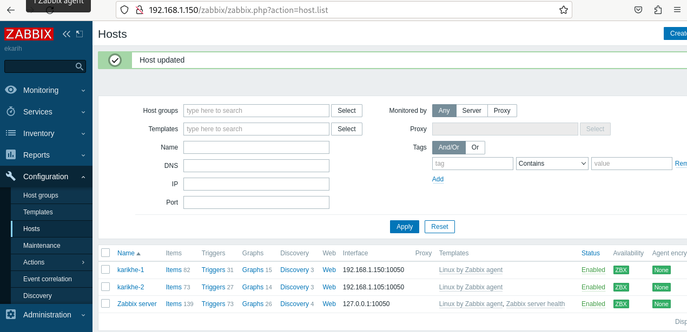
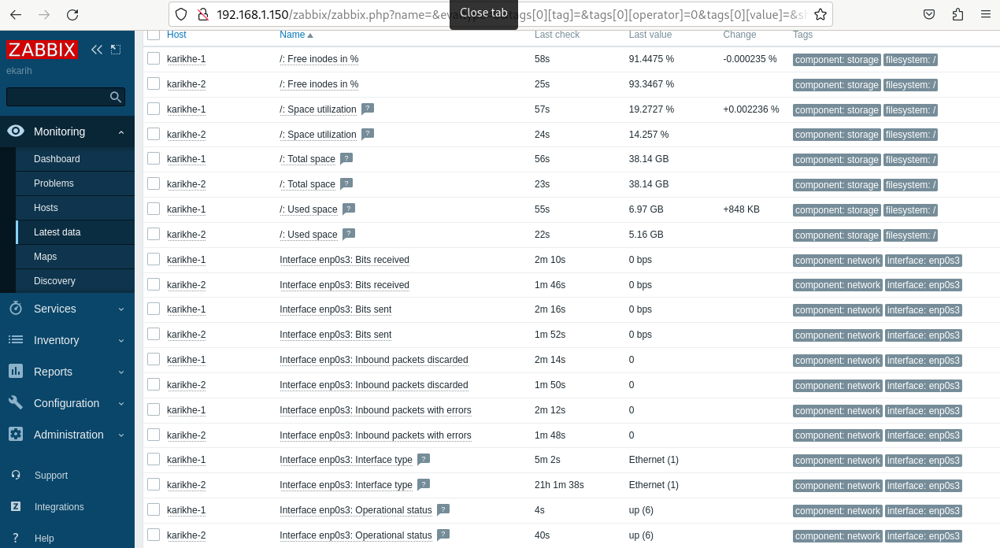
---
### Задание 3
Привяжите созданный шаблон к двум хостам. Также привяжите к обоим хостам шаблон Linux by Zabbix Agent.
Процесс выполнения
1. Выполняя ДЗ сверяйтесь с процессом отражённым в записи лекции.
2. Зайдите в настройки каждого хоста и в разделе Templates прикрепите к этому хосту ваш шаблон
3. Так же к каждому хосту привяжите шаблон Linux by Zabbix Agent
4. Проверьте что в раздел Latest Data начали поступать необходимые данные из вашего шаблона

Требования к результату
Прикрепите в файл README.md скриншот страницы хостов, где будут видны привязки шаблонов с названиями «Задание 2-3». Хосты должны иметь зелёный статус подключения

### Решение 3
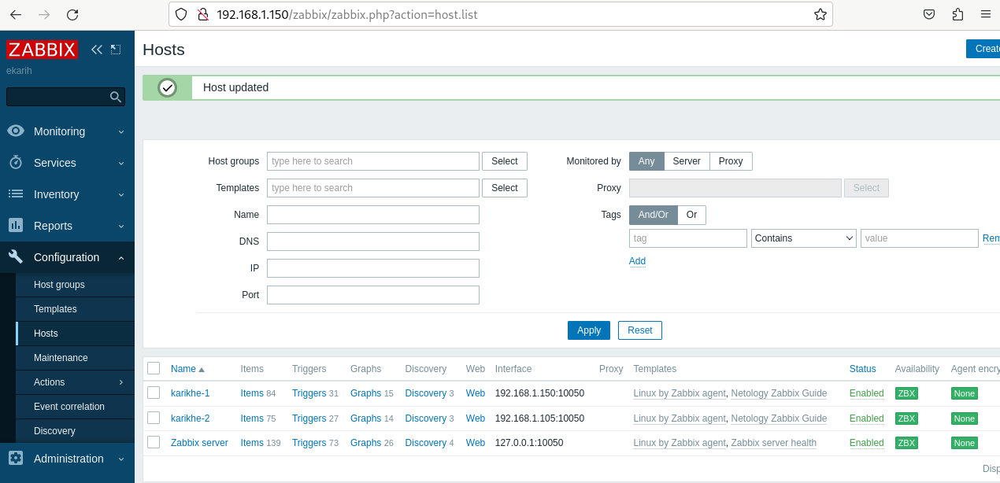
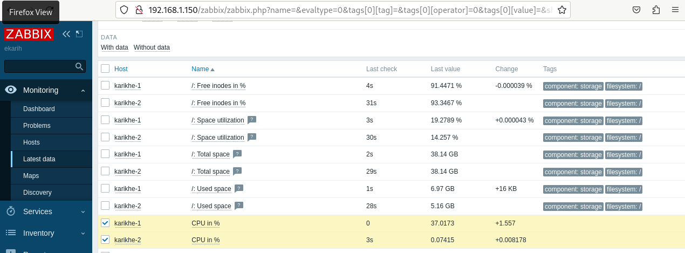
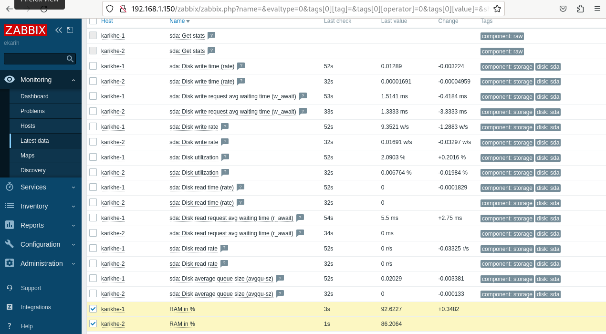
---
### Задание 4
Создайте свой кастомный дашборд.
Процесс выполнения
1. Выполняя ДЗ сверяйтесь с процессом отражённым в записи лекции.
2. В разделе Dashboards создайте новый дашборд
3. Разместите на нём несколько графиков на ваше усмотрение.

### Решение 4
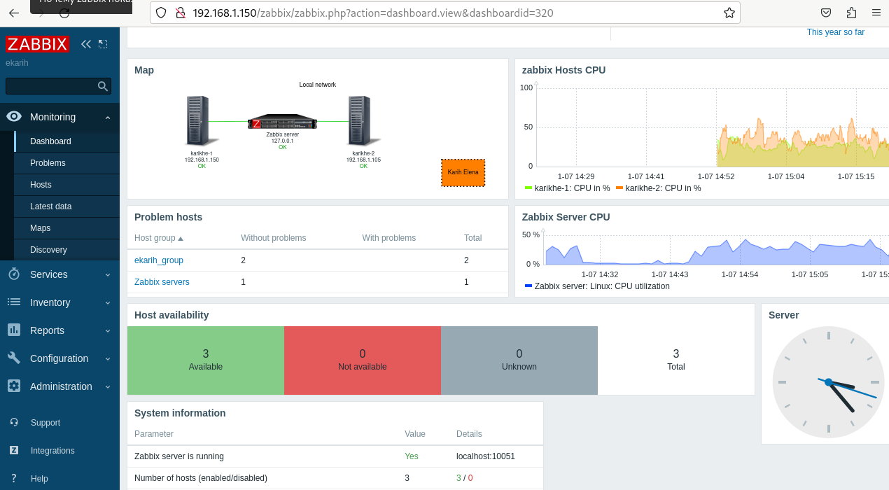
---
### Задание 5
Создайте карту и расположите на ней два своих хоста.
Процесс выполнения
1. Настройте между хостами линк.
2. Привяжите к линку триггер, связанный с agent.ping одного из хостов, и установите индикатором сработавшего триггера красную пунктирную линию.
3. Выключите хост, чей триггер добавлен в линк. Дождитесь срабатывания триггера.

### Решение 5
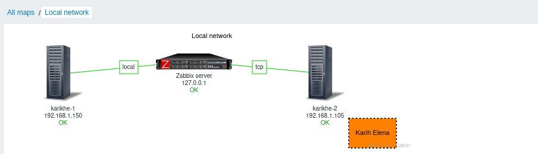
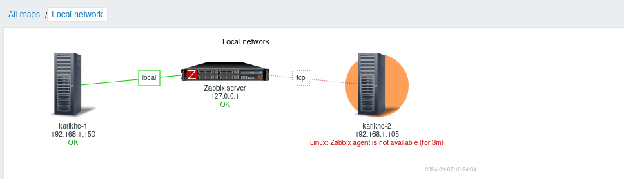
---
### Задание 6
Создайте UserParameter на bash и прикрепите его к созданному вами ранее шаблону. Он должен вызывать скрипт, который:
1. при получении 1 будет возвращать ваши ФИО,
2. при получении 2 будет возвращать текущую дату.

### Решение 6
 Скрипт: test_script.sh
```
#!/bin/bash

num=$1

if [[ $num -eq 1 ]]; then
echo "I'm Karikh Elena Nikolaevna"
elif [[ $num -eq 2 ]]; then
echo "Today $(date '+%F')"
else
echo "Error, try again..."
fi
```
* Скрин, при получении символа 1:
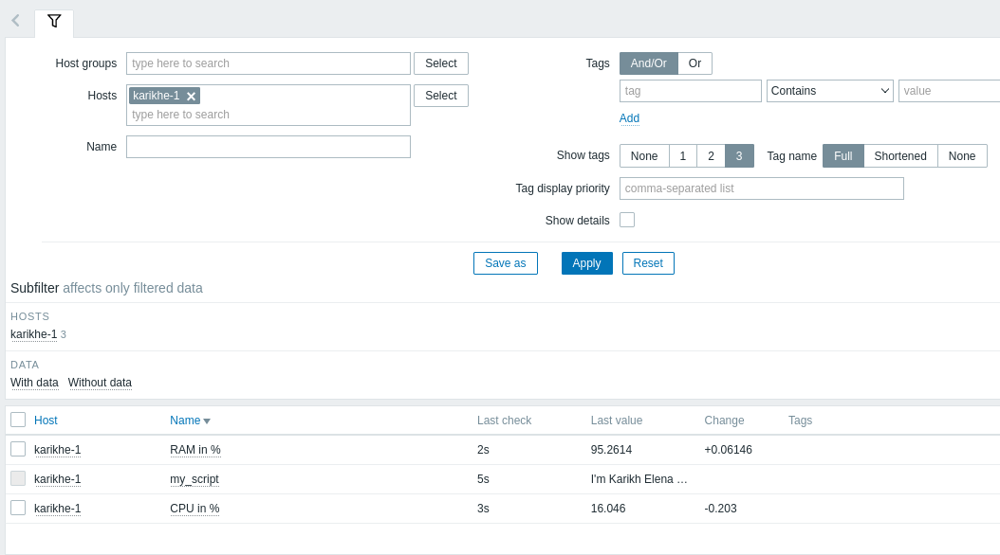
* Скрин, при получении символа 2:
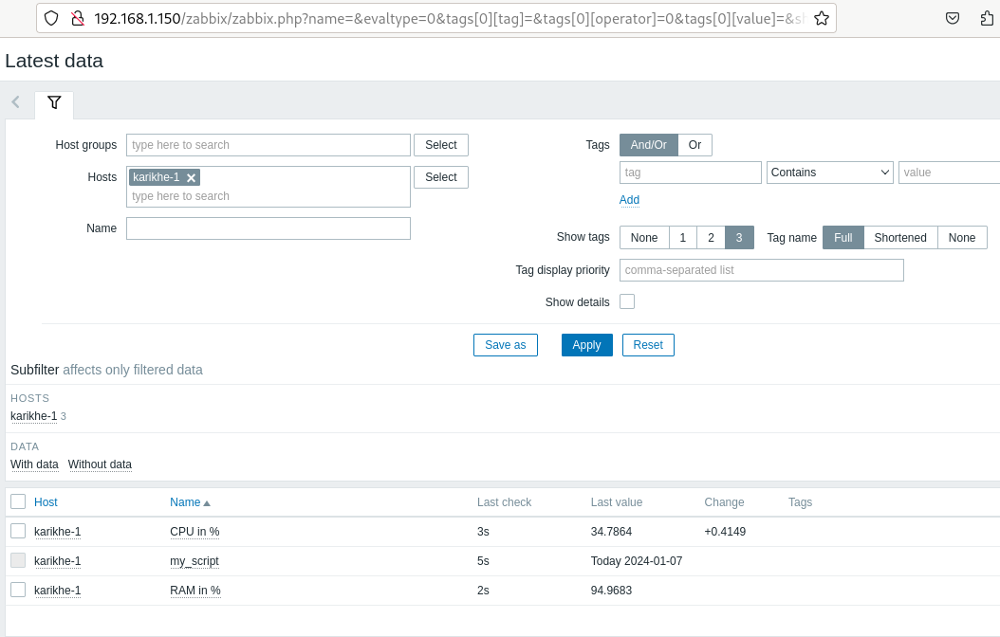
* Скрин, при получении символа 5 (ошибка):
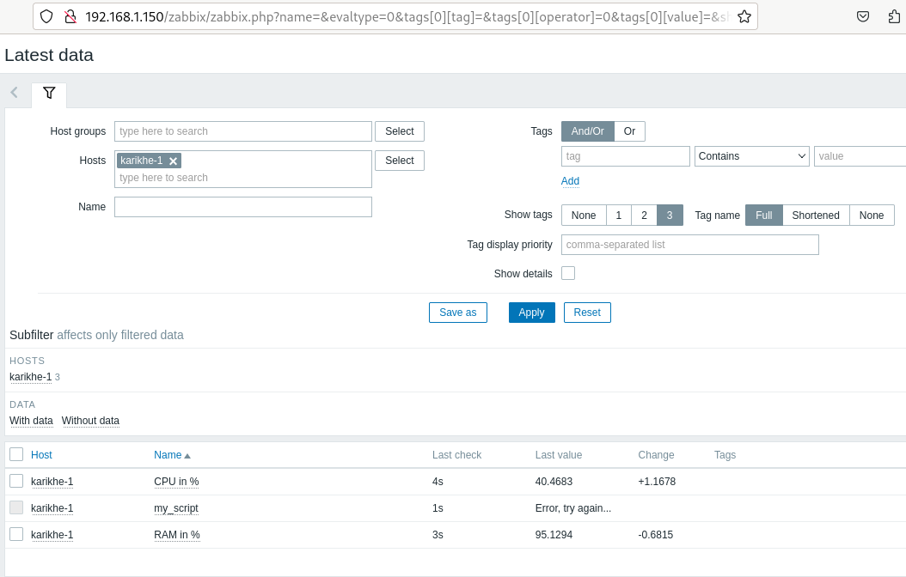
---
### Задание 7
Доработайте Python-скрипт из лекции, создайте для него UserParameter и прикрепите его к созданному вами ранее шаблону. Скрипт должен:
* при получении 1 возвращать ваши ФИО,
* при получении 2 возвращать текущую дату,
* делать всё, что делал скрипт из лекции.
Прикрепите в файл README.md код скрипта в Git. Приложите в Git скриншот Latest data с результатом работы скрипта на Python, чтобы были видны результаты работы скрипта при отправке в него 1, 2, -ping, а также -simple_print.*

### Решение 7
 Скрипт: test_py_script.py

```
import sys
import os
import re
from datetime import date
if (sys.argv[1] == "-ping"): # Если -ping
      result=os.popen("ping -c 1 " + sys.argv[2]).read() # Делаем пинг по заданному адресу
      result=re.findall(r"time=(.*) ms", result) # Выдёргиваем из результата время
      print(result[0]) # Выводим результат в консоль
elif (sys.argv[1] == "-simple_print"): # Если simple_print
      print(sys.argv[2]) # Выводим в консоль содержимое sys.arvg[2]
elif (sys.argv[1] == "1"): # Если  пришел символ 1
      print('Karikh Elena') # Выводим ФИО в консоль
elif (sys.argv[1] == "2"): # Если пришел символ 2
      print(date.today()) # Выводим в консоль date
else: # Во всех остальных случаях
      print(f"unknown input: {sys.argv[1]}") # Выводим непонятый запрос в консоль
```
* Скрин, при получении символа 1:
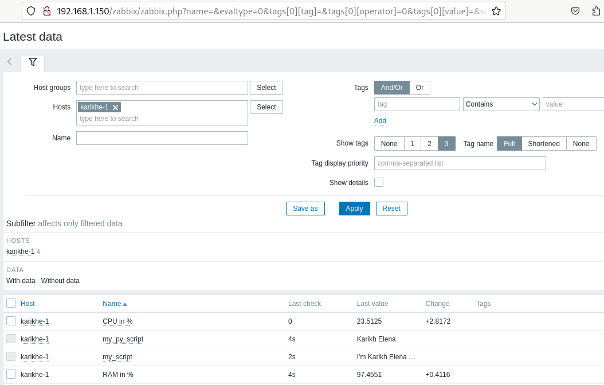
* Скрин, при получении символа 2:
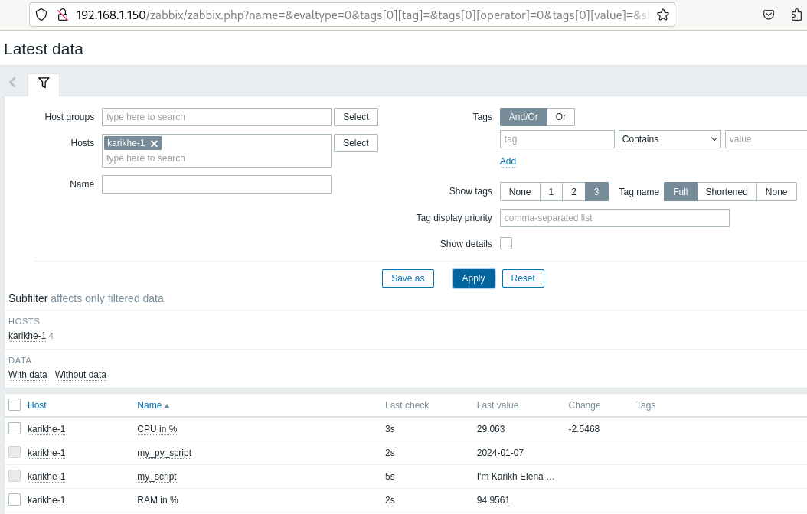
* Скрин, при получении -ping 8.8.8.8:
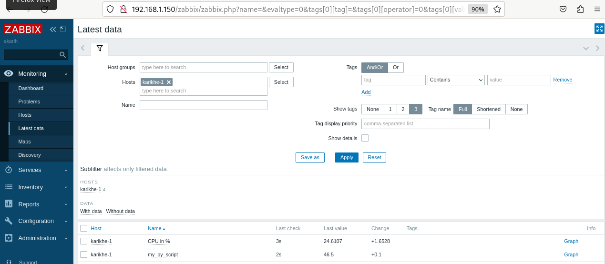
* Скрин, при получении -simple_print Test_print:

---
### Задание 8
Настройте автообнаружение и прикрепление к хостам созданного вами ранее шаблона.
### Решение 8
* Скрин, настроек автообнаружения:
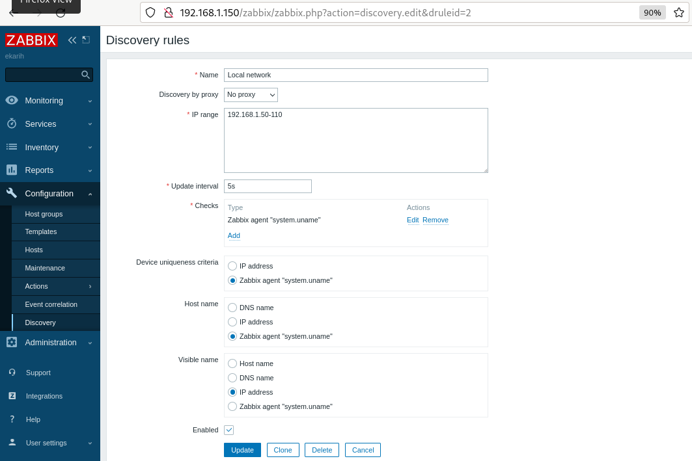
* Для проверки автообнаружения включила еще один хост с ubuntu и (к моему удивлению, т.к. для предыдущего ДЗ пыталась подключить Агента на Win10 и он ну никак не хотел его видеть) Агента на основном ПК с Windows10
Скрин, Monitoring => Discovery:
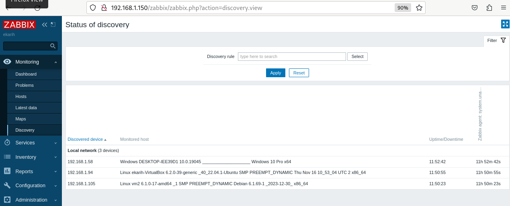
* Все перешли в Hosts
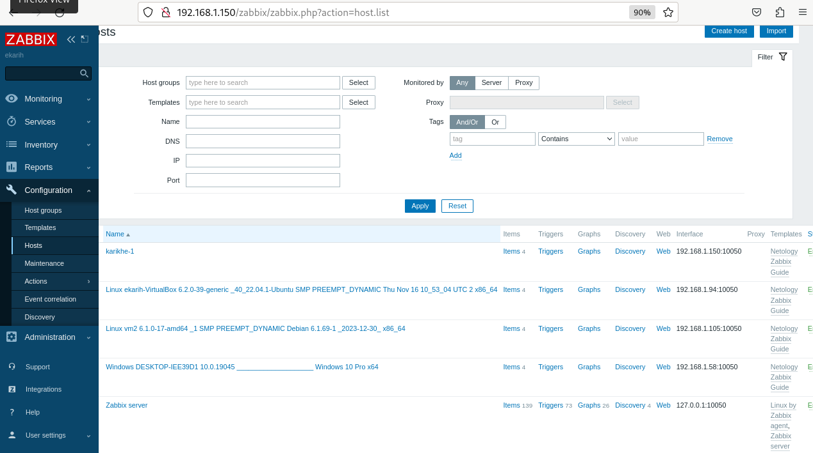
---
